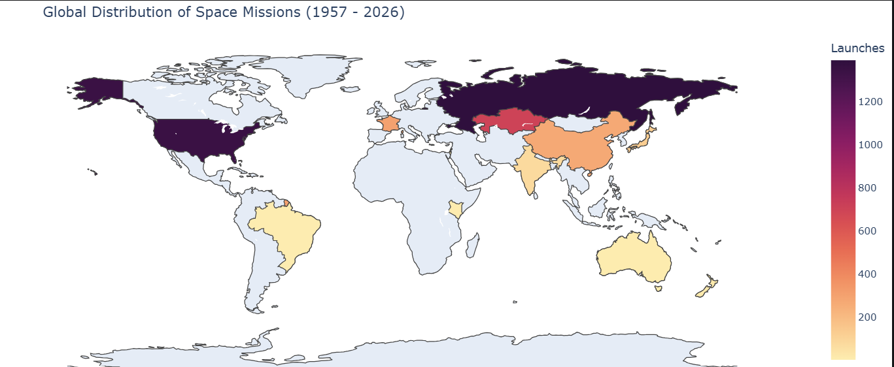
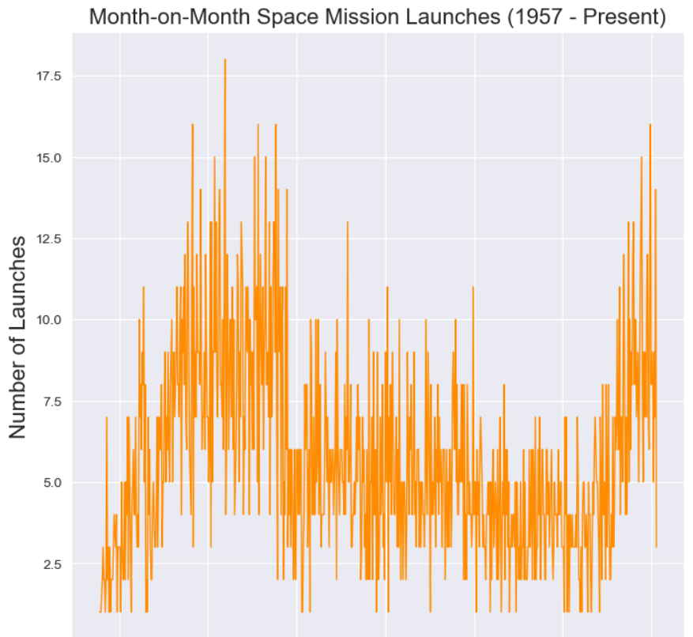
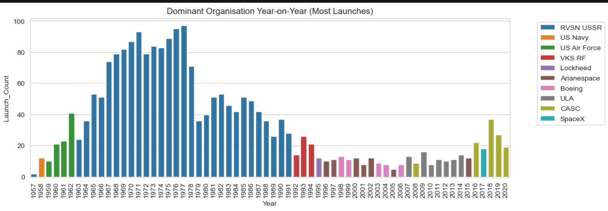
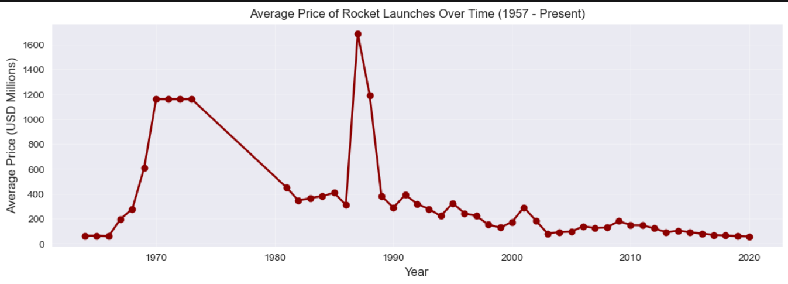
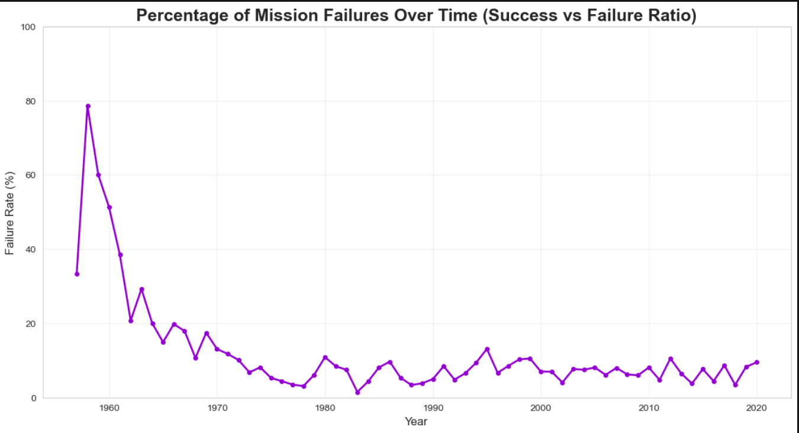
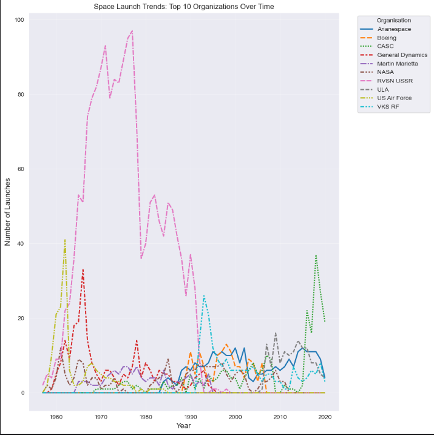

#  Space Mission Analytics: A Journey Through the Stars (1957 - Present)

## 👋 Welcome to the Project!
**Hello! I am Divya, thankyou for visiting here😊. This repository contains my deep-dive analysis into the history of global space exploration, covering every recorded mission from the launch of Sputnik in 1957 to the modern era of commercial spaceflight.**

**The goal of this project is to decode the patterns of the "Final Frontier." By analyzing nearly 70 years of launch data, I aim to provide an evidence-based perspective on how technology, economics, and geopolitics have shaped our journey into space.**

##  What You Will Learn from This Project
*By exploring this notebook, you will see a complete Data Science pipeline in action. Here is what we cover:*

* **Data Engineering:** Cleaning complex date formats and handling multi-currency financial data.
* **Superpower Rivalry:** A comparative study of the USA vs. USSR/Russia launch volumes.
* **Economic Analysis:** Visualizing the shifting costs of reaching orbit over decades.
* **Success Metrics:** Analyzing mission reliability and the "learning curve" of rocket science.

## Tech Stack & Skills
* **Language:** Python 3.x
* **Data Wrangling:** `Pandas`, `NumPy`
* **Data Visualization:** `Matplotlib`, `Seaborn`, `Plotly Express` (Interactive)
* **Time-Series Analysis:** Year-on-Year (YoY) Growth & Trend Modeling
* **Geospatial Analysis:** Interactive Choropleth Mapping for global launch density

## Key Insights & Visualizations

### 1. The Global Launch Footprint (Choropleth Map)
I utilized **Plotly Express** to create an interactive map identifying "Launch Intensity" by country. While the USA and Russia lead historically, the data highlights the rapid emergence of China and India as global space powers.

### 2. The Cold War Space Race (USA vs USSR)
I analyzed the intense rivalry between the two superpowers up to 1991. The data shows that while the USA achieved iconic milestones like the Moon landing, the USSR maintained a massive, consistent launch volume throughout the 70s and 80s.

** (a) Year-on-Year Superpower Comparison (USA vs USSR)**

** (b) Total Mission Share: USA vs USSR (Including Kazakhstan)**

### 3. Economic Trends (Average Price of Space)
Using a time-series trend, I identified how the **Average Price of Rocket Launches** has evolved. From the expensive Shuttle era to the modern cost-reduction driven by private players like SpaceX, space is becoming more accessible.

### 4. Mission Reliability & Success Rates
By calculating the **Failure Rate (%)** over time, the project reveals the technological "Learning Curve." Failure probability was nearly 40% in the late 1950s but has dropped to under 5% in the modern era.

** (a) Percentage of Mission Failures Over Time**

** (b) Distribution of Mission Status (Success vs. Failure)**

##  Data Cleaning & Preprocessing
To ensure an accurate analysis, several critical data cleaning steps were performed:
* **ISO Country Mapping:** Extracted country names from the "Location" field and standardized them for mapping (grouping USSR/Kazakhstan/Russia correctly).
* **Financial Formatting:** Cleaned the "Price" column by removing commas and currency symbols, converting them into numeric floats for analysis.
* **Datetime Conversion:** Converted mixed date formats to `datetime64[ns]` to extract Years and Months for time-series trend modeling.

##  Final Reflections & Conclusions
* **USSR's Volume:** Historically, the USSR (and its legacy sites in Kazakhstan) held the record for the highest frequency of launches for several decades.
* **Technological Maturity:** Rocket science has become exponentially more reliable, with failure rates hitting historic lows in the 21st century.
* **The Commercial Surge:** Post-2010 data shows a massive spike in activity, reflecting the rise of private organizations and global satellite constellations.

## AUTHOR:--
**DIVYA UPADHYAY 😊😊**
